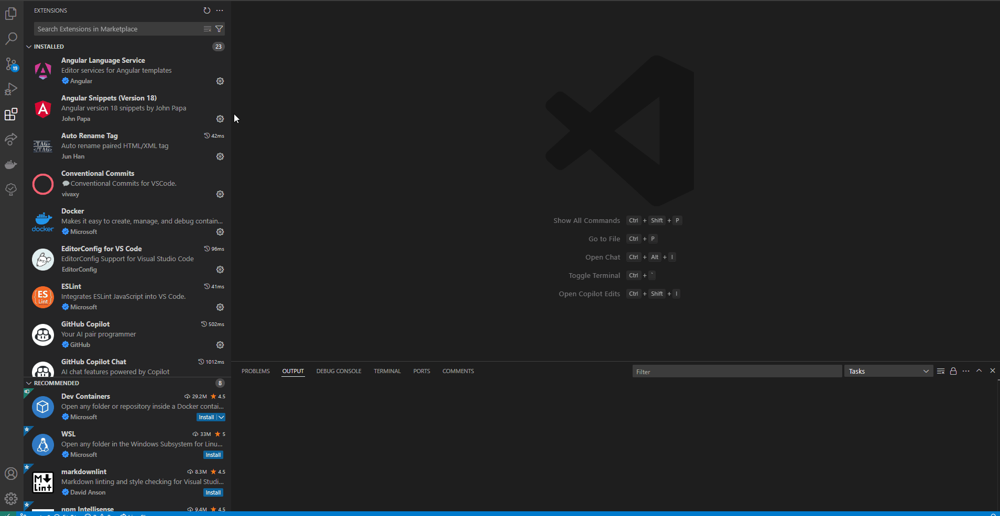
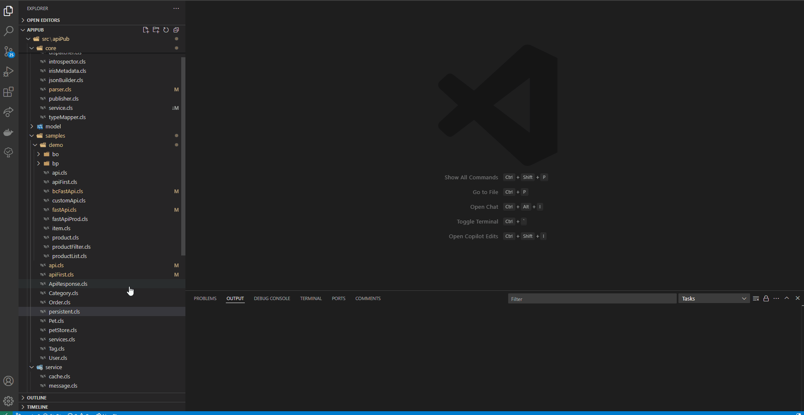
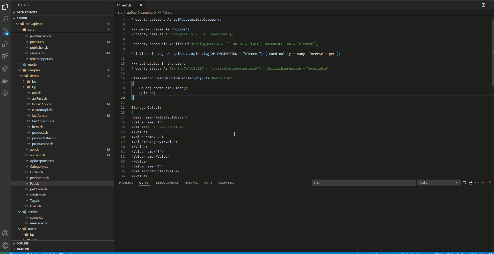
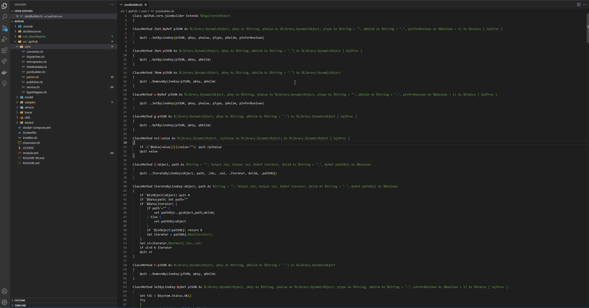

# InterSystems ObjectScript 类图查看器

[English](README.md) | [中文](README.zh-CN.md) | [Deutsch](README.de-DE.md)

一个用于生成 InterSystems ObjectScript 类的 UML 类图的 Visual Studio Code 扩展。该扩展不仅可以生成类图，还提供交互式查看和导航功能。

## 功能特性

- 从 `.cls` 文件生成 UML 类图
- 支持单个类和文件夹级别的图表生成
- 在编辑器和资源管理器中集成右键上下文菜单
- 可视化类关系、属性和方法
- 基于 PlantUML 实现可靠的图表渲染
- 使用 PlantUML Web 服务器生成图表（无需安装 Java）
- 交互式类图浏览
  - 点击类名、属性或方法可快速跳转到相应的代码
  - 在 HTML 中嵌入 SVG 图表，实现流畅的交互
  - 类关系的可视化导航

## 系统要求

| 操作系统 | 必需 | 可选（用于本地 PlantUML 生成） |
|---------|---------|-----------------------------------------|
| Windows | - VSCode 1.96.0+    - ObjectScript 类文件(`.cls`) | - Java 8+ |
| Linux   | - VSCode 1.96.0+    - ObjectScript 类文件(`.cls`) | - Java 8+   - Graphviz |

💡 *如果使用 PlantUML Web 服务器，则不需要 Java 和 Graphviz。*

## 安装
1. 通过 VS Code 安装扩展

2. 确保系统已安装 Java 运行时环境 (JRE)（如使用 PlantUML Web 服务器则可选）
3. 安装后重启 VS Code

## 使用方法

### 生成类图
1. 在编辑器中打开 `.cls` 文件
2. 使用以下方法之一生成类图：
   - 按下 `Ctrl+Alt+U`
   
   - 右键点击文件并选择"生成类图"
   
   - 右键点击包含 `.cls` 文件的文件夹并选择"生成类图"
   
3. 在提示时，选择您偏好的生成方式：
   - **本地 Java**：使用本地 Java 安装生成图表并在 VS Code 中显示
   - **PlantUML Web 服务器**：生成可在任何浏览器中打开的 URL（无需 Java）

### 使用 PlantUML Web 服务器
当选择"PlantUML Web 服务器"选项时：

- 无需本地安装 Java
- 图表在 PlantUML Web 服务器上生成
- 您可以将 URL 复制到剪贴板或直接在浏览器中打开
- 可以与他人分享 URL 以查看图表

### 交互功能
- 点击图表元素可以：
  - 跳转到类定义
  - 查看属性定义
  - 导航到方法实现
- 支持图表缩放和平移
- 清晰展示类之间的关系

## 键盘快捷键

- `Ctrl+Alt+U`：为当前打开的 `.cls` 文件生成类图

## 扩展设置

此扩展提供以下命令：

* `intersystems-objectscript-class-diagram-view.generateClassDiagram`：为选定的文件或文件夹生成类图

## 已知问题

- **外部库导航**：无法通过点击交互导航到 InterSystems ObjectScript 库定义
- **子类生成**：缺少为当前类生成子类图的功能
- **大型项目性能**：
  - 通过右键生成大型文件夹的图表可能会出现明显延迟
  - 大型项目生成的 webview/SVG 缺乏流畅的缩放功能和适当的缩放比例

如发现任何问题，请在 GitHub 仓库上报告。

## 贡献

欢迎贡献！请随时提交 Pull Request。

## 许可证

本扩展基于 MIT 许可证。