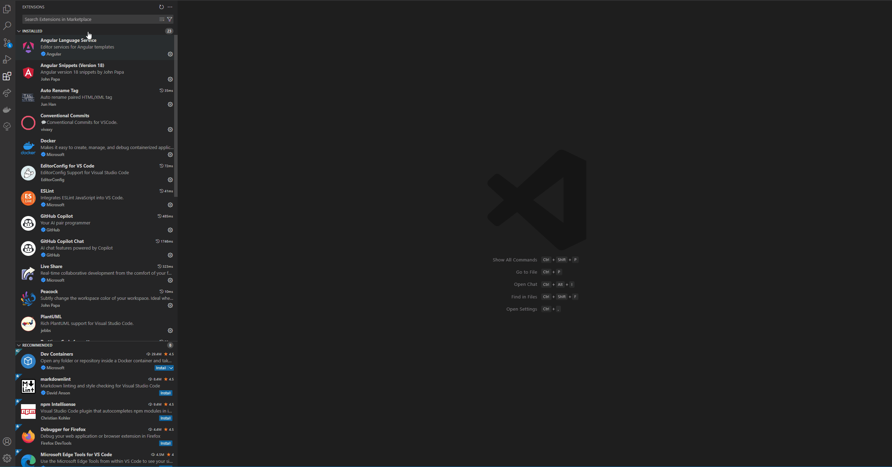

# InterSystems ObjectScript 类图查看器

[English](README.md) | [中文](README.zh-CN.md) | [Deutsch](README.de-DE.md)

一个用于生成 InterSystems ObjectScript 类的 UML 类图的 Visual Studio Code 扩展。此扩展不仅生成类图，还提供交互式显示和导航功能。

## 功能

- 从 `.cls` 文件生成 UML 类图
- 支持类、文件夹以及**多选文件**的图表生成
- 在编辑器和资源管理器中集成上下文菜单
- 可视化类关系、属性和方法
- 基于 PlantUML 提供可靠的图表表示
- 使用 PlantUML Web 服务器生成图表（无需安装 Java）
- **新增：** 与 InterSystems IRIS 直接集成，获取服务器端类信息
- **新增：** 从图表直接在 IRIS Documatic 中浏览类
- 交互式类图导航
  - 点击类名、属性或方法可快速跳转到相应代码
  - SVG 图表嵌入 HTML 中实现平滑交互
  - 类关系的可视化导航

## 要求

| 操作系统 | 必需 | 可选（用于本地 PlantUML 生成）|
|---------|---------|-----------------------------------------|
| Windows | - VSCode 1.96.0+    - ObjectScript 类文件(`.cls`) | - Java 8+ |
| Linux   | - VSCode 1.96.0+    - ObjectScript 类文件(`.cls`) | - Java 8+   - Graphviz |

💡 *使用 PlantUML Web 服务器时，不需要 Java 和 Graphviz。*

## 安装
1. 从 VS Code 安装扩展

2. 确保您的系统上已安装 Java 运行时环境 (JRE)（使用 PlantUML Web 服务器时可选）
3. 安装后重启 VS Code

## 使用方法

### 生成类图
1. 在编辑器中打开 `.cls` 文件
2. 使用以下方法之一生成类图：
   - 按下 `Ctrl+Alt+U`
   
   - 右键点击文件并选择"生成类图"
   
   - 右键点击包含 `.cls` 文件的文件夹并选择"生成类图"
   
   - 选中多个 `.cls` 文件 (Ctrl/Cmd+点击)，右键点击并选择"生成类图"
     - 这将创建一个仅包含所选类及其完整继承关系的聚焦图表
3. 出现提示时，选择您首选的生成方法：
   - **本地 Java**：使用本地 Java 安装生成图表并在 VS Code 中显示
   - **PlantUML Web 服务器**：生成可以在任何浏览器中打开的 URL（无需安装 Java）

### 使用 PlantUML Web 服务器
选择"PlantUML Web 服务器"选项时：

- 无需本地 Java 安装
- 图表在 PlantUML Web 服务器上生成
- 您可以将 URL 复制到剪贴板或直接在浏览器中打开
- 可以与他人共享 URL 以查看图表

### 使用 IRIS 集成生成类图
此功能依赖于 Intersystem 插件，它将从所选类生成所有类属性、参数和方法。
需要注意的是，该功能会生成整个继承层次结构，即使是本地项目中不存在的类也会包含在内。
1. 在 VS Code 设置中配置您的 IRIS 连接：
   - 前往设置 > 扩展 > InterSystems ObjectScript 类图
   - 输入您的 IRIS 服务器主机、端口、命名空间、用户名和密码
   
2. 在编辑器中打开 `.cls` 文件
3. 右键点击并选择"生成 InterSystems 类图"
   - 您也可以选中多个 `.cls` 文件 (Ctrl/Cmd+点击)，右键点击并选择"生成 InterSystems 类图"
     - 这将创建一个包含所有选中类的图表，并从 IRIS 服务器获取其完整信息
4. 扩展将连接到您的 IRIS 服务器并使用服务器中的类信息生成图表
5. 点击图表中的类名、属性或方法可以：
   - 在 IRIS Documatic 中打开类
   - 在 IRIS 中查看属性定义
   - 在 IRIS 中导航到方法实现
   

### 交互功能
- 点击图表元素可以：
  - 跳转到类定义
  - 查看属性定义
  - 导航到方法实现
- 支持图表缩放和平移
- 清晰可视化类关系

## 键盘快捷键

- `Ctrl+Alt+U`：为当前打开的 `.cls` 文件生成类图

## 扩展设置

此扩展提供以下命令：

* `intersystems-objectscript-class-diagram-view.generateClassDiagram`：为选定的文件或文件夹生成类图
* `intersystems-objectscript-class-diagram-view.generateIntersystemsClassDiagram`：使用 IRIS 服务器信息生成类图

此扩展提供以下设置：

* `intersystems-objectscript-class-diagram-view.server.host`：IRIS 服务器主机
* `intersystems-objectscript-class-diagram-view.server.port`：IRIS 服务器端口
* `intersystems-objectscript-class-diagram-view.server.namespace`：IRIS 命名空间
* `intersystems-objectscript-class-diagram-view.server.username`：IRIS 服务器用户名
* `intersystems-objectscript-class-diagram-view.server.password`：IRIS 服务器密码

## 已知问题

- **子类生成**：缺少为当前类生成子类图的功能
- **大型项目性能**：
  - 使用右键为大型文件夹生成图表可能会有明显延迟
  - 对于大型项目生成的 webview/SVG 缺乏流畅的缩放功能和适当的缩放

请在 GitHub 仓库中报告任何问题。

## 贡献

欢迎贡献！随时提交拉取请求。

## 许可证

此扩展根据 MIT 许可证授权。